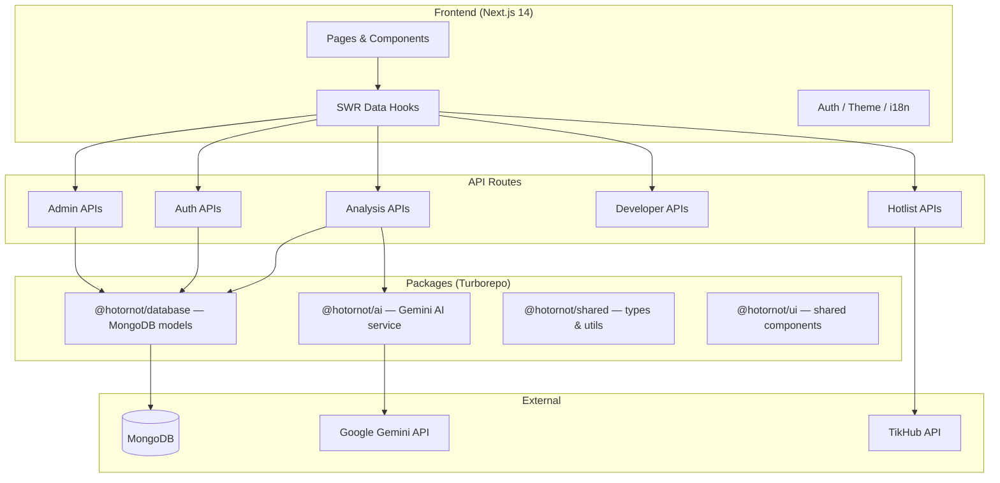

# HotOrNot 🔥 — 智能内容分析平台

AI 驱动的多平台内容分析平台，覆盖小红书、抖音、B站、微博。帮助创作者和营销人员找到爆款密码。

## ✨ 功能

- **内容分析** — 粘贴链接，AI 自动评估内容质量、互动潜力、优化建议
- **关键词分析** — 趋势方向、竞争度、热度评分、时机建议
- **账号分析** — 粉丝画像、内容策略、增长建议
- **实时热榜** — 四大平台热点话题实时追踪
- **批量分析** — 一次最多 10 条内容并发分析
- **数据导出** — PDF / CSV / JSON 多格式导出
- **团队协作** — 创建团队，共享分析结果
- **API 开放平台** — RESTful API，支持 API Key 认证
- **i18n** — 中文 / English
- **PWA** — 可安装，离线可用
- **暗黑模式** — 跟随系统或手动切换
- **推送通知** — 关键词上热榜浏览器提醒

## 🏗 架构



## 🚀 快速开始

### 前置要求

- Node.js 20+
- pnpm 8+
- MongoDB 6+

### 安装

```bash
git clone https://github.com/perhapzz/HotOrNot.git
cd HotOrNot
pnpm install
```

### 环境变量

```bash
cp apps/web/.env.example apps/web/.env.local
# 编辑 .env.local 填写必要配置
```

关键变量：

| 变量 | 说明 | 必填 |
|------|------|------|
| `MONGODB_URI` | MongoDB 连接串 | ✅ |
| `GEMINI_API_KEY` | Google Gemini API Key | ✅ |
| `TIKHUB_API_KEY` | TikHub 数据 API Key | ✅ |
| `JWT_SECRET` | JWT 签名密钥（随机字符串） | ✅ |
| `NEXT_PUBLIC_SITE_URL` | 站点 URL | ❌ |

### 开发

```bash
pnpm dev          # 启动开发服务器 (http://localhost:3000)
pnpm build        # 构建生产版本
pnpm test         # 运行测试
pnpm lint         # 代码检查
```

### Docker

```bash
docker compose up -d              # 启动应用 + MongoDB
docker compose --profile debug up  # 额外启动 mongo-express
```

## 📁 项目结构

```
HotOrNot/
├── apps/
│   └── web/                  # Next.js 14 应用
│       ├── src/
│       │   ├── app/          # App Router 页面 & API
│       │   ├── components/   # UI 组件
│       │   ├── hooks/        # 自定义 Hooks
│       │   └── lib/          # 工具函数
│       └── public/           # 静态资源
├── packages/
│   ├── ai/                   # AI 服务封装
│   ├── database/             # MongoDB 模型 & 连接
│   ├── shared/               # 共享类型 & 工具
│   └── ui/                   # 共享 UI 组件
├── docker-compose.yml
└── turbo.json
```

## 🧪 测试

```bash
pnpm test                     # 全部测试
pnpm test -- --coverage       # 覆盖率报告
```

## 📡 API

### 公开 API

开发者可通过 API Key 访问分析能力：

```bash
curl -H "X-API-Key: hon_your_key_here" \
  -H "Content-Type: application/json" \
  -d '{"url": "https://..."}' \
  https://hotornot.app/api/v1/analysis/content
```

详见 `/developer` 页面创建 API Key。

### 健康检查

```
GET /api/health
```

返回数据库连接、AI 服务状态、热榜新鲜度、内存使用。

## 📖 更多文档

- [环境变量配置指南](docs/ENV_CONFIG_GUIDE.md)
- [贡献指南](CONTRIBUTING.md)
- [项目规则](project_rules.md)

## 📄 License

MIT
